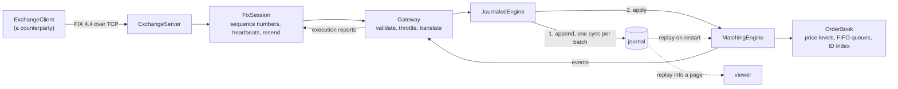

# PriceTime

A limit order book and matching engine: the program at the centre of an exchange. It holds every
resting buy and sell order, executes trades the moment the two sides cross under price-time
priority, and speaks FIX 4.4 to the clients that send it orders. Every command is on disk before it
is applied, so the exchange can be killed mid-session and rebuild the identical book by replaying
its journal.

Written in Python, with correctness and measurement weighted above raw speed. Where an exchange's
rules matter it follows the ones the National Stock Exchange of India (NSE) publishes: daily price
bands, DAY and IOC validity, market price protection, and self-trade prevention. One runtime
dependency, used only to frame FIX messages.

## See it work

**[Open the replay page](https://aditya-7117.github.io/PriceTime/)** and step through a recorded
session: the book after every command, what the engine said about it, the trades, and how far a
market order could have reached before price protection stopped it. It is a window onto a recorded
engine, not a trading screen, so there is nothing to click but the tape.

Or run an exchange and trade against it, in two terminals:

```sh
python -m pricetime.exchange serve                  # a FIX exchange on 127.0.0.1:5001
python -m pricetime.exchange trade                  # rests an offer, crosses it, cancels the rest
```

```
SELL-1: resting, 100 left of 0 done, exchange order DEMOCO:1
BUY-1: resting, 60 left of 0 done, exchange order DEMOCO:2
SELL-1: traded 60 at 100.00, 40 left of 60 done, exchange order DEMOCO:1
BUY-1: traded 60 at 100.00, 0 left of 60 done, exchange order DEMOCO:2
SELL-2: cancelled, 0 left of 60 done, exchange order DEMOCO:1
```

Then replay what the exchange wrote, into a page of your own:

```sh
python -m pricetime.viewer run/DEMOCO.jsonl --symbol DEMOCO -o session.html
```

## What it does

**The matching engine.** Limit and market orders, cancel and replace, under price-time priority,
with DAY and IOC validity. A daily price band per instrument. NSE's market price protection: a
market order trades no further than a set percentage from the last traded price. NSE's self-trade
prevention: an order never trades with its own client's order, and each order says at entry whether
the incoming or the resting order is the one to cancel. Prices are integer ticks, converted from
decimal strings exactly, and a price off the tick grid is refused rather than rounded.

**The FIX 4.4 layer.** A session layer with logon, heartbeats, test requests, sequence numbers in
both directions, resend requests, gap fill and possible-duplicate handling, and a gateway that
turns NewOrderSingle, OrderCancelRequest and OrderCancelReplaceRequest into commands and every
event back into an ExecutionReport or OrderCancelReject. Accounts are registered with the exchange
before they can trade, as a client code is on NSE. Each session can carry an order rate limit, and
can ask for its orders to be cancelled if its connection drops.

**Durability.** Every command is appended to a write-ahead journal and forced to disk before a
single acknowledgement leaves the building, a batch at a time, so a burst of orders shares one disk
sync. Recovery replays the journal and rebuilds each client's view of its own orders from what the
journal recorded about them. Session state is persisted too, so a client that reconnects gets the
messages it missed rather than a hole.

**Measurement.** An open-loop benchmark with a published method, a baseline to measure against, and
the disappointing numbers left in.

## Numbers

One command through the engine, and one order's full round trip over FIX. Microseconds.

| | p50 | p99 | p99.9 | max |
|---|---|---|---|---|
| A command applied by the engine | 1.38 | 4.54 | 7.83 | 8,818 |
| The same, garbage collector paused | 1.38 | 4.33 | 6.83 | 149 |
| FIX order to execution report, forced to disk | 524 | 1,286 | 4,789 | 23,591 |
| Baseline: a bare asyncio echo over the same socket | 116 | 182 | 283 | 454 |

p50 is the median; p99 is the value ninety-nine commands in a hundred beat. Read together, those
rows say two things worth saying out loud. The engine's tail belongs to CPython, not to the
matching: pausing the garbage collector drops the worst case from 8.8 milliseconds to 149
microseconds. And most of a FIX round trip is not the exchange: an empty echo over the same
loopback socket costs 116 microseconds before any parsing, matching or journalling happens at all.

Apple M5 Pro, CPython 3.12, 20,000 orders per second, five seconds of steady state after two
seconds of warm-up, open loop so that a stall is counted against every order waiting through it.
The method, the order mix, what these numbers are not, and what would make them better are in
[docs/benchmarks.md](docs/benchmarks.md). Reproduce them with `python -m pricetime.bench`.

## Architecture



| Module | Role |
|---|---|
| `orders.py` | `Side`, and `Order`, which is its own node in its level's queue |
| `level.py` | `PriceLevel`: the queue of orders at one price, oldest first |
| `book.py` | `BookSide`: one side's levels in priority order. `OrderBook`: both sides and the ID index |
| `commands.py` | The four inputs: `NewLimitOrder`, `NewMarketOrder`, `CancelOrder`, `ModifyOrder` |
| `events.py` | Everything the engine reports: accepts, trades, cancels, replaces, rejections |
| `rules.py` | `MarketRules`: the per-instrument, per-session rules, such as the daily price band |
| `engine.py` | `MatchingEngine`: the matching rules |
| `snapshot.py` | An immutable copy of the full state, and a SHA-256 digest of it |
| `prices.py` | Exact conversion between decimal wire prices and integer ticks |
| `codec.py` | The journal's line format, decoded strictly |
| `journal.py` | The write-ahead journal, replay, and `JournaledEngine` |
| `fix/wire.py` | Framing and checksums: the only module that touches the FIX library |
| `fix/tags.py` | Tag numbers and the FIX 4.4 values this exchange uses |
| `fix/session.py` | `FixSession`: the session layer, with no sockets in it |
| `fix/store.py` | Where a session keeps its sequence numbers and sent messages |
| `fix/reports.py` | Execution reports and cancel rejects, built from engine events |
| `fix/gateway.py` | Validation, throttling, and translation both ways |
| `fix/server.py` | The asyncio server: sockets, timers, group commit |
| `fix/client.py` | A client, mostly so the tests and the benchmark have a counterparty |
| `viewer/` | Replay a journal into one self-contained page |
| `bench.py` | The open-loop latency benchmark |
| `exchange.py` | `serve` and `trade` from the command line |

## How matching works

An incoming order walks the opposite side of the book from the best price, and each price level
from its oldest order, trading until it is filled or the next price is beyond its limit. Each trade
happens at the resting order's price, so any price improvement goes to the incoming order. A DAY
limit order rests whatever it cannot fill; an IOC order cancels it.

A market order follows NSE's market price protection (circular 155/2022). It is rejected until the
session's first trade, because a protection band is measured from the last traded price. It trades
no further than X% from that price. If orders remain beyond the band, its remainder is cancelled.
Otherwise the other side of the book is empty, and a DAY market order rests as a limit order at the
best price on its own side, or at the last traded price if its own side is empty too.

An order never trades with an order from its own client. Each order carries a client ID and its own
choice, as NSE's self-trade prevention check allows: cancel active cancels what is left of the
incoming order; cancel passive cancels the resting order and keeps matching behind it.

The engine takes one command at a time and returns the list of events it caused. It calls nothing
while matching, so no outside code can re-enter it mid-match. It reads no clock and no randomness:
time priority is the order in which commands arrive. That is what makes replay exact.

The cases that take care:

- **An order that sweeps several levels.** It trades through each level in turn and rests any
  remainder at its own limit. It stops only when the next resting price is beyond that limit, so the
  book never crosses.
- **A cancel for an order being matched.** Commands never interleave, so the cancel lands either
  before the fill or after it. After a full fill it is rejected as too late and the trade stands.
  After a partial fill it cancels only the open remainder.
- **A replace that should lose queue position.** A replace keeps its place only if the price is
  unchanged and the open quantity does not grow. A new price or a larger size sends it to the back
  of the queue at its new price, and it trades at once if the new price crosses. The new quantity is
  the new total including fills, as in a FIX 4.4 cancel/replace, so a replace that races a fill
  cannot leave the owner with more than they asked for.

## How the FIX layer works

`FixSession` has no sockets in it. Bytes and a timestamp go in, and a list of things to do comes
out: send these bytes, deliver this message, the session is logged on, drop the line. The asyncio
server does the actual reading, writing and waiting. That split is what makes the hard parts
testable: a test can lose a packet, deliver messages out of order, reorder a resend, or reconnect a
session mid-stream, with no sockets and no sleeping, and watch exactly what the session does about
it.

What the session layer handles: logon with a negotiated heartbeat interval, heartbeats and test
requests in both directions, an incoming sequence number that is too high (ask for a resend and
chase the gap), a resend request for messages already sent (replay them with PossDupFlag and the
original sending time, and gap-fill the administrative ones), a logout, and a line that simply
disappears. A message whose body length or checksum is wrong is discarded, and the decoder
resynchronises on the next message rather than swallowing it.

The gateway is where an order becomes a command. It checks the instrument, the account, the side,
the quantity, the order type and the price, refuses anything it does not like with the FIX reason
code for it, throttles a session that exceeds its order rate, and keeps enough of each order to
build a correct execution report: cumulative quantity, average price, and the exchange's own order
ID. Nothing is acknowledged until the journal for that batch is on disk.

## What is checked, and how hard

Each invariant below is a [hypothesis](https://hypothesis.readthedocs.io/) property test, checked
after every command of every generated command sequence:

| Invariant | How it is checked |
|---|---|
| The book never crosses | The best bid is always below the best ask |
| Shares are conserved | A ledger rebuilt from commands and events alone, never from the engine's counters, must match the book order for order |
| A cancel removes exactly one order | The book after a cancel equals the book before it minus that one order |
| Replay is deterministic | Two engines given the same commands produce identical events and identical state, and a journal replayed in fresh interpreters under different hash seeds gives the same state digest |
| Trades follow price-time priority | An incoming order trades with a prefix of the opposite side in priority order, and stops only when it must |
| A replace keeps its place only when shrinking in place | Otherwise the order is last at its new price, or gone |
| The structure is consistent | Level order, queue links, level totals and the ID index agree |
| Nothing rests outside the price band | Every resting order's price is inside the day's band |
| An IOC order never rests | After its command, no IOC order is on the book |
| Market orders follow market price protection | A remainder is cancelled for protection only if orders lie beyond the band; otherwise IOC cancels and DAY rests at the price the circular names |
| The last traded price is the latest trade | It always equals the price of the most recent trade, or the opening price before any |
| No client trades with itself | Every trade's two orders belong to different clients |

A second, deliberately naive implementation of the same rules (one flat list of orders, the other
side sorted from scratch at every step) acts as an oracle: on every generated sequence, the engine
must produce exactly the same events and the same state after every command.

Tests that pass prove nothing about tests that could fail, so twenty-six deliberate bugs were
planted in the engine one at a time, twelve in the core matching and fourteen in the NSE rules. The
property suite caught every one. The reasoning is in
[decision 8](docs/decisions/0008-property-test-design.md).

The FIX layer is tested the same way where it can be: sessions joined by a link the test controls,
so packet loss, reordering, duplicate logons and reconnections are ordinary test cases rather than
things that happen to other people. Two bugs in this repository were found that way, not by
inspection: a resend request that was never repeated after a lost reply, leaving both sides waiting
forever, and a logon that arrived ahead of its sequence number and hung the reconnection.

## Quick start

Python 3.12 or later. CI runs the tests on 3.12, 3.13 and 3.14.

```sh
python3 -m venv .venv
source .venv/bin/activate
python -m pip install --require-hashes -r requirements-dev.lock
python -m pip install --no-deps -e .
```

Run what CI runs:

```sh
ruff check .
ruff format --check .
mypy
pytest --cov
```

Build the demo page, or benchmark the engine:

```sh
python -m pricetime.demo          # writes docs/demo/session.jsonl and docs/index.html
python -m pricetime.bench         # prints the latency table, and how it was measured
```

Use the engine directly:

```python
from pricetime.commands import CancelOrder, NewLimitOrder
from pricetime.engine import MatchingEngine
from pricetime.events import Trade
from pricetime.orders import Side
from pricetime.rules import MarketRules, PriceBand

rules = MarketRules(
    price_band=PriceBand(lower=90, upper=110),
    protection_bps=500,  # market orders may trade up to 5% from the last traded price
    protection_min_ticks=2,
    opening_price=100,
)
engine = MatchingEngine(rules)
engine.process(NewLimitOrder(side=Side.SELL, price=101, quantity=100, client_id=1))
engine.process(NewLimitOrder(side=Side.SELL, price=102, quantity=100, client_id=1))

events = engine.process(NewLimitOrder(side=Side.BUY, price=102, quantity=150, client_id=2))
trades = [(e.price, e.quantity) for e in events if isinstance(e, Trade)]
assert trades == [(101, 100), (102, 50)]

engine.process(CancelOrder(order_id=2))
assert engine.book.best_ask() is None
```

Prices are integer ticks: at a ₹0.05 tick, ₹2450.35 is 49007. `pricetime.prices` converts decimal
strings to ticks exactly and refuses a price off the tick grid. Order IDs are issued by the engine,
starting at 1. An order priced outside the day's band is rejected. The protection percentage above
is illustrative; NSE sets its value by separate notice.

## Decisions

Every design choice has a short record in [docs/decisions](docs/decisions/): the context, the
options considered, what was chosen, and what it costs.

## Limitations

Stated plainly, because a reviewer will find them anyway.

- **One instrument per engine, one engine per journal.** There is no symbol on a command; the
  gateway routes to an engine by symbol instead.
- **Limit and market orders only.** No stop-loss orders, no fill-or-kill, no disclosed (iceberg)
  quantity, and no pre-open call auction.
- **No market data.** There is no book feed: the only way out of the engine is the execution
  reports of the session that sent the orders, and the journal. The replay page reads the journal.
- **Restart replays the whole journal.** There are no snapshots, so recovery time grows with the
  session's length.
- **A torn final journal record stops recovery.** It is reported, not repaired.
- **Single-threaded Python.** Throughput is bounded by one core and by CPython, and the tail is
  bounded by its garbage collector. A C++ port of the matching path is the next piece of work.
- **No authentication and no encryption.** Logon is by CompID, as the FIX session layer defines it,
  with no password check and no TLS. It is meant for a trusted network, and nothing here should face
  the internet.

## Licence

[MIT](LICENSE).
