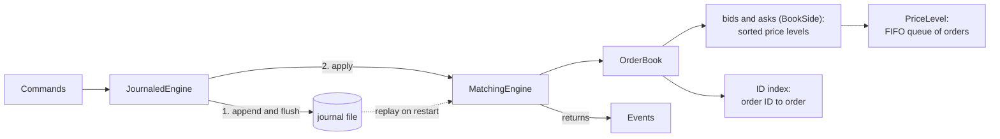

# PriceTime

A limit order book and matching engine: the program at the centre of an exchange. It holds every
resting buy and sell order and executes trades the moment the two sides cross, under price-time
priority. Every command is journaled before it is applied, and replaying the journal rebuilds the
identical book.

Written in Python. Correctness and measurement come before raw speed.

## What works today

- Limit and market orders, cancel and modify, under price-time priority.
- Price levels as first-in, first-out queues built from intrusive linked lists, and an index from
  order ID to order, so a cancel is a dictionary lookup and an unlink rather than a scan.
- An append-only, write-ahead journal of every command, with replay and crash recovery.
- Property-based tests that check seven invariants after every command of generated command
  sequences.

Not built yet: the FIX 4.4 session layer and the latency benchmark. See [Limitations](#limitations).

## Architecture



| Module | Role |
|---|---|
| `orders.py` | `Side`, and `Order`, which is its own node in its level's queue |
| `level.py` | `PriceLevel`: the queue of orders at one price, oldest first |
| `book.py` | `BookSide`: one side's levels in priority order. `OrderBook`: both sides plus the ID index |
| `commands.py` | The four inputs: `NewLimitOrder`, `NewMarketOrder`, `CancelOrder`, `ModifyOrder` |
| `events.py` | Everything the engine reports: accepts, trades, cancels, modifies, rejections |
| `rules.py` | `MarketRules`: per-instrument, per-session rules such as the daily price band |
| `engine.py` | `MatchingEngine`: the matching rules |
| `snapshot.py` | An immutable copy of the full state, and a SHA-256 digest of it |
| `prices.py` | Exact conversion between decimal wire prices and integer ticks |
| `codec.py` | The journal's line format, decoded strictly |
| `journal.py` | The write-ahead journal, replay, and `JournaledEngine` |

## How matching works

An incoming order walks the opposite side of the book from the best price, and each price level
from its oldest order, trading until it is filled or the next price is beyond its limit. Each trade
happens at the resting order's price, so any price improvement goes to the incoming order. A limit
order rests whatever it cannot fill. A market order cancels it.

The engine takes one command at a time and returns the list of events it caused. It calls nothing
while matching, so no outside code can re-enter it mid-match. It reads no clock and no randomness:
time priority is the order in which commands arrive. That is what makes replay exact.

The cases that take care:

- **An order that sweeps several levels.** It trades through each level in turn and rests any
  remainder at its own limit. It only stops when the next resting price is beyond that limit, so
  the book never crosses.
- **A cancel for an order being matched.** Commands never interleave, so the cancel lands either
  before the fill or after it. After a full fill it is rejected as too late and the trade stands.
  After a partial fill it cancels only the open remainder.
- **A modify that should lose queue position.** A modify keeps its place only if the price is
  unchanged and the open quantity does not grow. A new price or a larger size sends it to the back
  of the queue at its new price, and it trades at once if the new price crosses. The new quantity is
  the new total including fills, as in a FIX 4.4 cancel/replace, so a modify that races a fill
  cannot leave the owner with more than they asked for.

## Invariants

Each of these is a [hypothesis](https://hypothesis.readthedocs.io/) property test, checked after
every command of every generated command sequence:

| Invariant | How it is checked |
|---|---|
| The book never crosses | The best bid is always below the best ask |
| Shares are conserved | A ledger rebuilt from commands and events alone, never from the engine's counters, must match the book order for order |
| A cancel removes exactly one order | The book after a cancel equals the book before it minus that one order |
| Replay is deterministic | Two engines given the same commands produce identical events and identical state, and a journal replayed in fresh interpreters under different hash seeds gives the same state digest |
| Trades follow price-time priority | An incoming order trades with a prefix of the opposite side in priority order, and stops only when it must |
| A modify keeps its place only when shrinking in place | Otherwise the order is last at its new price, or gone |
| The structure is consistent | Level order, queue links, level totals and the ID index agree |

The generator follows the order IDs it has issued, so cancels and modifies mostly hit live orders.
To check that the tests can fail, twelve deliberate bugs were planted in the engine one at a time;
the property suite caught every one. Details are in
[decision 8](docs/decisions/0008-property-test-design.md).

## Quick start

Needs Python 3.12 or later and nothing else.

```sh
python3 -m venv .venv
source .venv/bin/activate
python -m pip install --require-hashes -r requirements-dev.lock
python -m pip install --no-deps -e .
```

Run the checks CI runs:

```sh
ruff check .
ruff format --check .
mypy
pytest --cov
```

Use the engine:

```python
from pricetime.commands import CancelOrder, NewLimitOrder
from pricetime.engine import MatchingEngine
from pricetime.events import Trade
from pricetime.orders import Side
from pricetime.rules import MarketRules, PriceBand

engine = MatchingEngine(MarketRules(price_band=PriceBand(lower=90, upper=110)))
engine.process(NewLimitOrder(side=Side.SELL, price=101, quantity=100))
engine.process(NewLimitOrder(side=Side.SELL, price=102, quantity=100))

events = engine.process(NewLimitOrder(side=Side.BUY, price=102, quantity=150))
trades = [(e.price, e.quantity) for e in events if isinstance(e, Trade)]
assert trades == [(101, 100), (102, 50)]

engine.process(CancelOrder(order_id=2))
assert engine.book.best_ask() is None
```

Prices are integer ticks: at a ₹0.05 tick, ₹2450.35 is 49007. `pricetime.prices` converts decimal
strings to ticks exactly and refuses a price off the tick grid. Order IDs are issued by the engine,
starting at 1. An order priced outside the day's band is rejected.

## Decisions

Each design choice has a short record in [docs/decisions](docs/decisions/): the context, the
options, what was chosen and what it costs.

## Limitations

- **No FIX session layer yet.** Commands are Python objects. The FIX 4.4 layer comes next.
- **No benchmark yet,** so this README publishes no latency figures. When they come, they will come
  with their method.
- **One instrument per engine.** There is no symbol on a command.
- **No self-match prevention.** Two orders from the same owner can trade with each other, because
  orders carry no owner yet.
- **Limit and market orders only.** No stop orders, no immediate-or-cancel or fill-or-kill limit
  orders, no hidden or iceberg quantity.
- **Restart replays the whole journal.** There are no snapshots, so recovery time grows with the
  journal's length.
- **A torn final journal record stops recovery.** It is reported, not repaired.
- **Single-threaded Python.** Throughput is bounded by one core and by CPython.

## Licence

[MIT](LICENSE).
